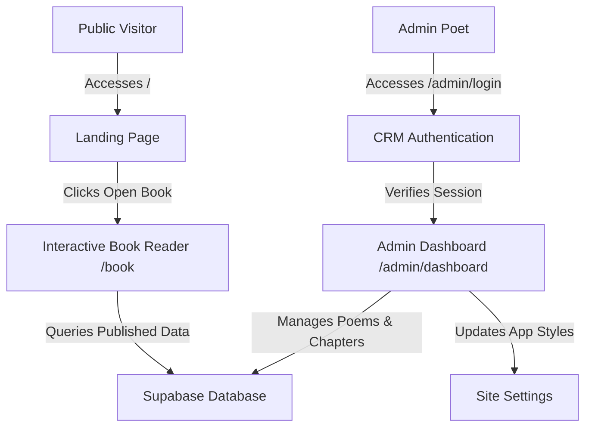

# 📖 Words by Debangan

An immersive, premium digital poetry journal and publisher. The application features a stunning, interactive 3D page-flipping book reader on the frontend and a private, secure content management system (CRM) on the backend for drafting, organizing, and publishing literary works.

---

## 🎨 Design Philosophy & Aesthetics

*   **Tactile Authenticity**: Styled with a customized, responsive Sepia and Dark mode color palette that mimics aged handmade paper, cotton bindings, and letterpress ink.
*   **Dynamic Typography**: Powered by Next.js font optimization loaders serving **Tiro Bangla** (for classical Bengali script styling) and **EB Garamond** (for elegant Latin translations).
*   **Micro-interactions**: Subtle CSS animations simulate page lifts, 3D buttons, and real-time page-turning dynamics.

---

## 🛠️ Technology Stack

| Layer | Technology | Role |
| :--- | :--- | :--- |
| **Frontend** | **Next.js 16 (App Router)** | Core framework providing server-rendered pages and dynamic metadata. |
| **Styling** | **Tailwind CSS v4** | CSS utility engine using modern theme directives and CSS custom variables. |
| **Database** | **Supabase (PostgreSQL)** | Persistent storage for poems, chapters/collections, and site configurations. |
| **Auth** | **Supabase Auth** | Secure session management, access controls, and admin CRM route locks. |
| **Language** | **TypeScript** | Static typing and type safety across all components and data models. |

---

## 📐 System Architecture & Data Flow



### 1. Database Schema
*   **`poems`**: Holds Bengali verses, English translations, font sizing preferences, text alignment rules, publish statuses, and display order keys.
*   **`collections`**: Manages book chapters, sorting indices, and custom descriptions.
*   **`site_settings`**: Global configuration parameters (site title, biography, themes) editable dynamically in the CRM.

### 2. Protected Routes Middleware
*   CRM security is handled via Next.js routing middleware.
*   Any request to `/admin/...` (excluding the login page) checks for a valid Supabase authorization session. Unauthenticated sessions are instantly redirected to `/admin/login`.

---

## ⚙️ Core Mechanics & Features

### 📖 Dynamic Pagination Engine
The Book Reader ([BookReader.tsx](file:///c:/Users/royde/Downloads/WORDSBYDEB/src/components/BookReader.tsx)) compiles database rows into an indexed array of book spreads:
1.  **Page 0**: Closed cover featuring a custom sunset layout.
2.  **Page 1**: Dynamic Author Biography with a custom portrait avatar.
3.  **Page 2**: Interactive Table of Contents.
4.  **Poem Spreads**: Generates a two-page spread for each poem—the left page displays the English translation, and the right page renders the Bengali original.
5.  **Alignment & Sizing**: Automatically formats sizes (`sm`, `md`, `lg`, `xl`) and alignments (`left`, `center`, `right`, `justify`) chosen in the editor.

### 📜 Scroll & Text-Wrap Safeguards
*   **Scroll-down Mechanics**: Long poems automatically align to the top and scroll vertically within their page boundary rather than overflowing the physical book frame.
*   **Wrap-Word Enforcement**: Using `whitespace-pre-wrap` and `break-words`, text elements wrap cleanly at margins, eliminating horizontal scrolling.

### 🧼 Invisible Unicode Sanitizer
When copying poetry from text processors (Google Docs, Word, WhatsApp), hidden characters can corrupt web page rendering. A built-in sanitization pipeline cleans pasted text:
*   Standardizes carriage returns (`\r\n`) to Unix line breaks (`\n`).
*   Replaces non-breaking spaces (`\u00A0`) with regular spaces to ensure correct line wrapping.
*   Strips zero-width spaces (`\u200B`) and invalid ASCII control characters.
*   Preserves Zero-Width Joiners (`\u200D` / `\u200C`) to maintain Bengali spelling integrity.

### 🔍 Search Engine Optimization (SEO)
*   **Dynamic Metadata**: Exports `generateMetadata` on public routes to load database-stored titles and biographies for search engine crawlers.
*   **Robots Rule (`robots.ts`)**: Configures search crawlers to scan the homepage and book pages while strictly disallowing access to the CRM.
*   **Sitemap (`sitemap.ts`)**: Automatically generates a `/sitemap.xml` file mapping public URLs.
*   **Noindex Layout**: All pages under `/admin` inherit noindex/nofollow headers via layout configuration.

---

## 🚀 Running Locally

### 1. Prerequisite Configuration
Create a `.env.local` file in the root folder with your Supabase credentials:
```env
NEXT_PUBLIC_SUPABASE_URL=your_supabase_project_url
NEXT_PUBLIC_SUPABASE_ANON_KEY=your_supabase_anonymous_key
```

### 2. Install Dependencies
```bash
npm install
```

### 3. Run Development Server
```bash
npm run dev
```
Open [http://localhost:3000](http://localhost:3000) in your browser to view the application.

### 4. Build for Production
To build, optimize, and validate TypeScript files:
```bash
npm run build
```

---

## 🔑 Administrative Access

To create a new administrator account in Supabase Auth, execute the admin utility script from your terminal:
```bash
node create-admin.js <email> <password>
```
To change the password of an existing administrator account, execute the change password utility script:
```bash
node change-password.js <email> <old_password> <new_password>
```
